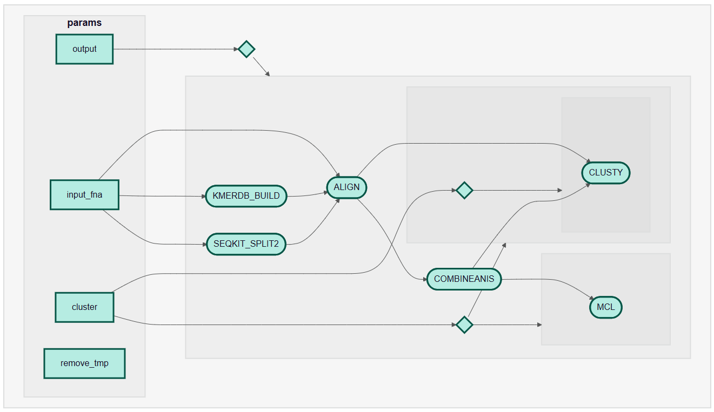

# UHVDB/nucleotidecluster
A Nextflow wrapper for clustering viral genomes using nucleotide similarity.

### Overview
This wrapper performs the following steps:

1. Split `--input_fna` into chunks of size `--chunk_size`
2. Create a kmer-db database for `--input_fna`
3. Align each chunk against the kmer-db database
4. Combine alignment outputs across chunks
5. Cluster using alignment outputs (OPTIONAL)
- `--cluster false` to bypass clustering
- `--cluster clusty` to cluster with Clusty (for dereplication)
- `--cluster mcl` to cluster with MCL

*Auto-generated DAG for this workflow:*


### Quick start
In addition to automated downloads and cleanup (limiting disk requirements), this wrapper also makes setup very easy.

First, install Conda/Mamba/Micromamba/Pixi
*Example Micromamba installation*
```
"${SHELL}" <(curl -L micro.mamba.pm/install.sh)
```

Then create a Nextflow environment with singularity
```
micromamba create -n nextflow -c conda-forge -c bioconda nextflow singularity -y
```

Activate the Nextflow environment
```
micromamba activate nextflow
```

Then just run the pipeline!
```
nextflow run UHVDB/nucleotidecluster -profile test,<docker/singularity/conda/mamba>
```

### Usage
The arguments for this tool are:

`--input_fna`: Path (or URL) to input virus FNA file (default: null)

`--chunk_size`: Number of sequences per chunk after splitting (default: 10,000)

`--min_ani`: Minimum ANI for filtering alignments and clustering (default: 0.95)

`--min_qcov`: Minimum query coverage for filtering alignments and clustering (default: 0.85)

`--cluster`: Clustering methodology (default: false; other options = 'clusty' or 'mcl')

`--output`: Prefix for output ANI and cluster TSV files (default: null)

`--remove_tmp`: Remove all intermediate files (default: false)


### Output
The outputs of this wrapper are:

1) an ANI TSV file with _ columns (`query`, `reference`, `tani`, `gani`, `ani`, `qcov`, `rcov`)
```tsv
query	reference	tani	gani	ani	qcov	rcov
NC_005091	NC_005091.alt2	0.966298	0.964424	0.964911	0.999495	0.999859
NC_005091.alt2	NC_005091	0.966298	0.967989	0.968125	0.999859	0.999495
NC_005091.alt1	NC_005091	0.970072	0.970151	0.971368	0.998747	0.998712
```
2) and a clustering file if `--cluster` is not false

if `--cluster clusty` is input, a TSV file assigning each sequence to a cluster representative:
```tsv
object	cluster
NC_010807.alt2	NC_010807.alt2
NC_010807.alt3	NC_010807.alt2
NC_010807	NC_010807.alt2
```

if `--cluster mcl` is input, a tab separated file where each line contains the members of a cluster:
```tsv
NC_010807.alt3	NC_010807.alt2	NC_010807	NC_010807.alt1
NC_005091	NC_005091.alt2	NC_005091.alt1
NC_025457.alt1	NC_025457
NC_002486.alt	NC_002486
```

### Credits
This wrapper was made by @CarsonJM. However, primary credit of course goes to the vClust developers (who developed kmer-db, lz-ani, and vClust)(https://github.com/refresh-bio/vclust), and their work should be cited if this wrapper is used (https://doi.org/10.1038/s41592-025-02701-7).
